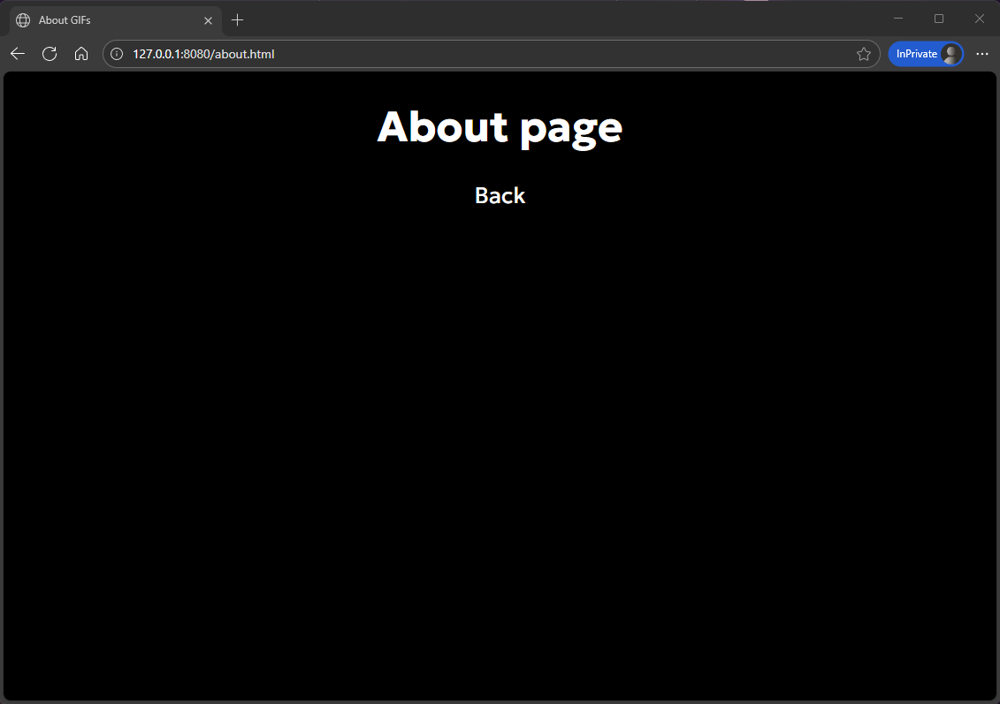

# Laboratory work №1: Nginx + Docker

## Task description

Create web server in Docker with Nginx and mount HTML page.
Result on `127.0.0.1:8080` (**upd:** now on 5050 port)

## Installation

1. ### Clone repo
    ```sh
    git clone https://github.com/deltamemories/nginx-lab
    cd nginx-lab
    ```

2. ### Start containers:
    ```sh
    docker-compose up -d --build
    ```

3. ### Open `127.0.0.1:5050` in browser

## Project description:
docker-compose.yml — Nginx server  
src/code/index.html — main HTML page  
src/code/about.html — about HTML page  
src/code/stylesheet.css — styles for HTML pages  
src/assets/videos/ — GIFs  
screenshots/ — all screenshots  

## Screenshots




