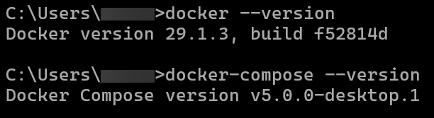
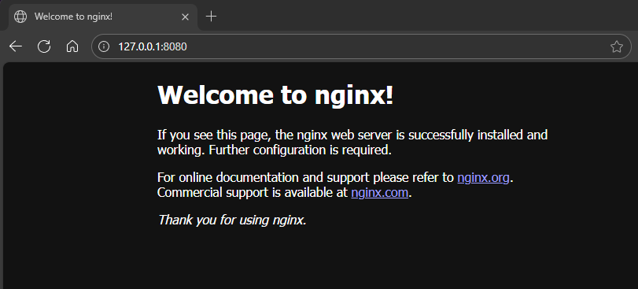
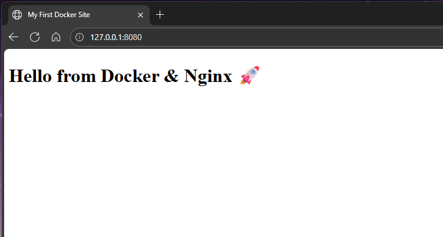

## Task description

Create web server in Docker with Nginx and mount HTML page.
Result on `127.0.0.1:8080`

## Installation

1. ### Clone repo
    ```sh
    git clone https://github.com/deltamemories/nginx-lab
    cd nginx-lab
    ```

2. ### Start containers:
    ```sh
    docker-compose up -d --build
    ```

3. ### Open 127.0.0.1 in browser
    #### Project description:
    docker-compose.yml — Nginx server  
    code/index.html — main HTML page  
    screenshots/ — all screenshots  
4. ### Screenshots
    
    
    
